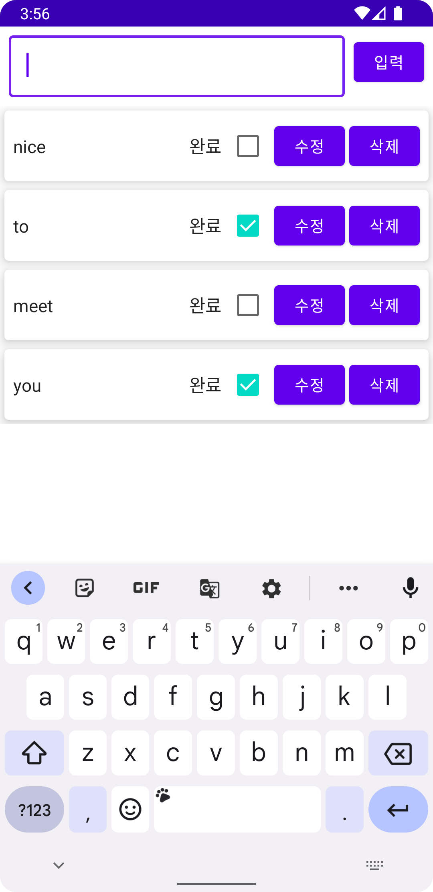
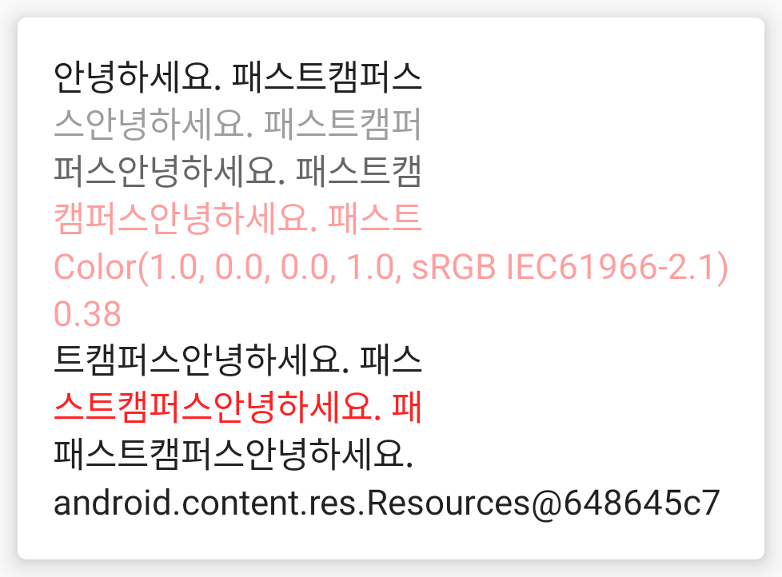
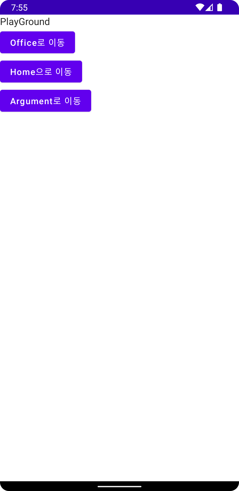
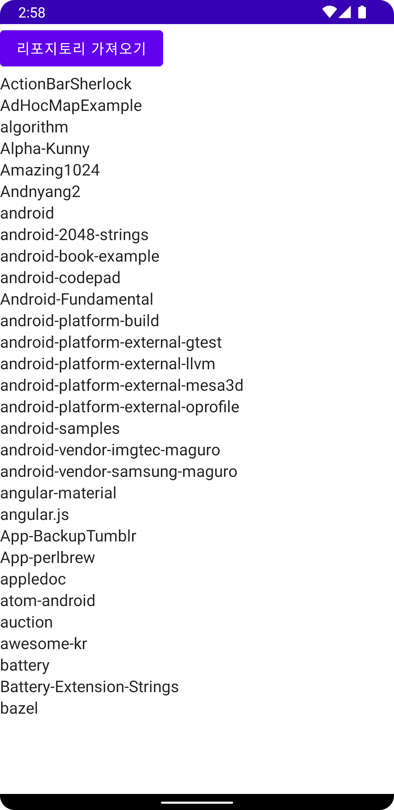
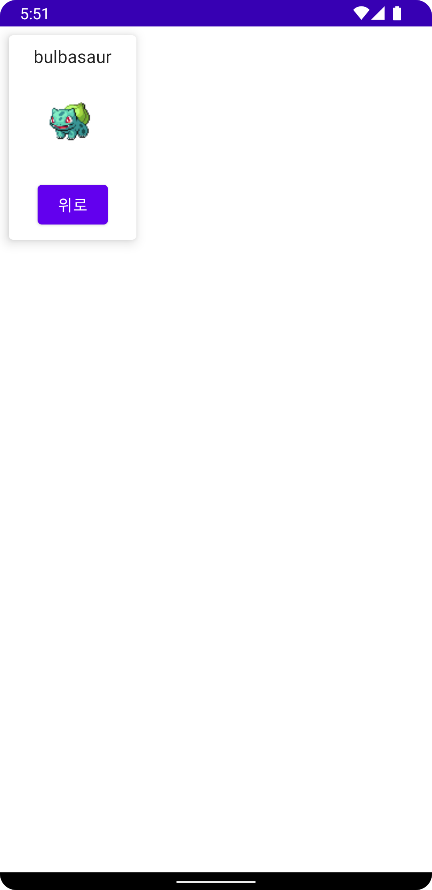

# Part4 Chapter5

Part4 Chapter5의 예제와 실습을 모두 담고 있습니다.

[최종본](../../tree/final)과 비교해보세요.

## Compose ViewModel 실습코드 (part4-chapter5-2)

[part4-chapter5-2](part4-chapter5-2) 디렉토리를 Android Studio에서 오픈하세요.



 * 단계 1: "androidx.lifecycle:lifecycle-viewmodel-compose:2.5.1" 의존성을 추가합니다.

 * 단계 2: `ViewModel`을 상속받은 `ToDoViewModel`을 만듭니다. 첫 단계에서는 내용을 비워두고 시작합시다.

 * 단계 3: `TopLevel`의 파라미터로 `ToDoViewModel` 타입의 `viewModel`을
  전달합니다. 기본 값은 `viewModel()`로 설정합시다.
  에러가 발생하면 아래의 `import` 문을 추가합니다.

  ```kotlin
  import androidx.lifecycle.viewmodel.compose.viewModel
  ```

 * 단계 4: text, setText를 뷰 모델로 옮겨봅시다.
  뷰 모델의 프로퍼티로 변경할 경우에는 destrunction (비구조화,구조 분해)는 사용할
  수 없으니 `by`를 써봅시다. `remember`는 제거해야 합니다.

 * 단계 5: `toDoList`, `onSubmit`, `onEdit`, `onToggle`,
  `onDelete`를 모두 뷰 모델로 옮겨봅시다.

## Compose ViewModel 실습코드 (part4-chapter5-3)

[part4-chapter5-3](part4-chapter5-3) 디렉토리를 Android Studio에서 오픈하세요.

 * 단계 1: "androidx.compose.runtime:runtime-livedata:$compose_ui_version" 의존성을 추가합니다.

 * 단계 2: text 상태를 라이브 데이터로 변경합니다.
  사용하는 측에서는 `text.observeAsState()`로 구독하세요.

 * 단계 3: toDoList 상태를 라이브 데이터로 변경합니다.
  모든 연산에서 List를 새로 만들어 라이브 데이터로 전달해야 합니다!!!
  (초 비추!!)

## Compose CompositionLocal 실습코드 (part4-chapter5-4)

[part4-chapter5-4](part4-chapter5-4) 디렉토리를 Android Studio에서 오픈하세요.



  * 단계 1: `CompositionLocalProvider`을 이용하면 특정 블록에 암시적인 값을 설정할 있습니다.
  `CompositionLocalProvider(LocalContentAlpha provides ContentAlpha.abled)`
  등을 설정해봅시다.
  `LocalContentAlpha`를 `ContentAlpha.disabled`로 설정하겠다는 뜻입니다.
  `ContentAlpha.medium`, `ContentAlpha.high`, `ContentAlpha.abled`등을
  제공할 수 있습니다.
  `LocalContentColor`도 설정해봅시다. `Color.XXX`을 설정하면 됩니다.

 * 단계 2: 중간 중간에 `LocalContentColor.current` 등의 값을 출력해봅시다.
  가장 가까운 곳에서 설정한 값을 `current`로 얻을 수 있습니다.

 * 단계 3: `LocalContext.current`의 `resources`를 출력해보세요.

 * 단계 4: `compositionLocalOf`에 `8.dp`를 넣어 `LocalElevation`을 할당합니다.

 * 단계 5: Card의 elevation에 `LocalElevation`을 적용해봅시다.
 * 단계 6: LocalElevation의 값을 `CompositionLocalProvider`로
  바꾸어 봅시다.

## Compose Theme 실습코드 (part4-chapter5-5)

[part4-chapter5-5](part4-chapter5-5) 디렉토리를 Android Studio에서 오픈하세요.


 * 단계 1: ThemeTestTheme으로 이동합니다.

 * 단계 2: `onSurface` 값을 할당합니다.
   `surface` 값도 할당해봅시다.

 * 단계 3: `primary`와 `onPrimary` 값도 바꾸어봅시다.

 * 단계 4: `body1`의 `fontSize`를 변경해봅시다.

## Compose Navigation 실습코드 (part4-chapter5-6)

[part4-chapter5-6](part4-chapter5-6) 디렉토리를 Android Studio에서 오픈하세요.



 * 단계 1: 의존성 "androidx.navigation:navigation-compose:2.5.3"을 추가합니다.

 * 단계 2: `navController` 파라미터를 만듭니다.
  `NavHostController` 타입에 기본 값은 `rememberNavController()`

 * 단계 3: `NavHost`를 만듭니다.
  `navController`, `"Home"`, `modifier`를 전달합시다.

 * 단계 4: `composable("Home")`를 만들고 안에 "Office로 이동" 버튼을
  만듭니다.

 * 단계 5: `composable("Office")`를 만들고 텍스트를 넣어봅시다.
  "Office로 이동" 버튼에 `navController.navigate("Office")`를
  넣어줍니다.

 * 단계 6: `Playground`를 만들고 `Home`, `Office`, `Playgorund`를
  서로 연결합니다.

 * 단계 7: Home, Office, Playgorund, Home, Office, Playgorund
  순으로 이동한 후 백버튼을 계속 눌러서 이동을 확인해봅시다.

 * 단계 8: navigate에 후행 람다로 `popUpTo("Home")`을 넣고 스택 이동을
  확인해봅니다.

 * 단계 9: `popUpTo`의 후행 람다에 `inclusive = true`를 넣어보고
  스택 이동을 확인해봅시다.

 * 단계 10: `Home`에서 `Home`으로 가는 버튼을 만들고
  `launchSingleTop = true`을 설정해보세요.

 * 단계 11: "Argument/{userId}"를 라우트로 받는
  composable을 만드세요.
  `arguments?.get("userId")`을 받아 출력하세요.
  "Argument/fastcampus"로 이동하는 버튼을 만들어보세요.

## Compose DI 실습코드 (part4-chapter5-7)

[part4-chapter5-7](part4-chapter5-7) 디렉토리를 Android Studio에서 오픈하세요.



 * 단계 1: DIApp 클래스를 android:name 항목으로 연결합니다.

 * 단계 2: DIApp을 `@HiltAndroidApp`로 어노테이션합니다.

 * 단계 3: Activity에 @AndroidEntryPoint를 넣어줍시다.

 * 단계 4: `AppModules`에 `@Module` 어노테이션과 `@InstallIn(SingletonComponent::class)`
  어노테이션을 추가합니다.

 * 단계 6: @HiltViewModel 어노테이션을 지정합니다.

 * 단계 7: 생성자에 @Inject를 붙여줍시다.

## Compose Pokemon 실습코드 (part4-chapter5-9)

[part4-chapter5-9](part4-chapter5-9) 디렉토리를 Android Studio에서 오픈하세요.



 * 단계 1: viewModel을 제대로 설정하자. `hiltViewModel()`를 사용한다.

 * 단계 2: `offset=20&limit=20` 형태의 주소에서 `prevKey`와 `nextKey`를 만들어 전달하자.

 * 단계 3: arguments 파라미터를 설정하자.
  ```
  navArgument("pokemenId") {
  type = NavType.IntType
  }
  ```
  리스트로 전달해야 한다.

* 단계 4: `pokemonId`를 `Int`값으로 가져오자. (`arguments?.getInt`를 이용)